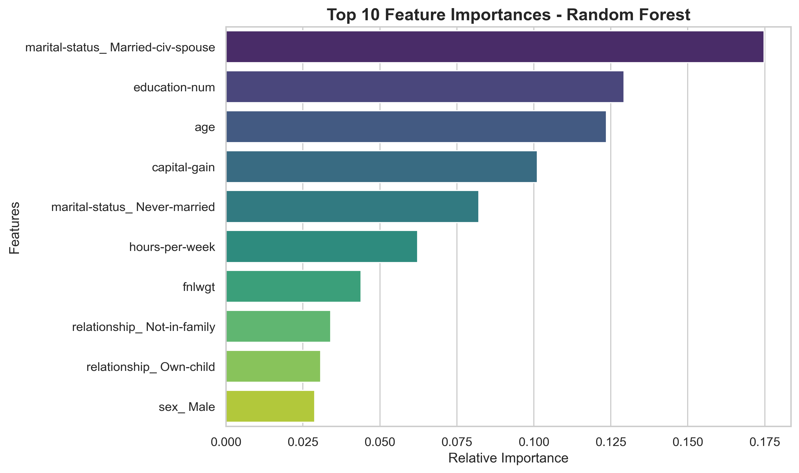

# Adult Census Income - Model Insights

## Project Overview

This project analyzes the factors influencing individual income using the 1994 Adult Census Income dataset. After evaluating several machine learning models, **Random Forest Classifier** was selected as the final model due to its optimal balance between performance (predicting >50K income with 82% recall and 0.70 F1-score) and interpretability.

## Top 10 Feature Importances (Random Forest)

The chart below visualizes the ten most significant features determined by the tuned Random Forest model. These features have the strongest relative influence on the model's decision to predict whether an individual earns more than $50,000 annually.

## Key Business Insights

Based on the feature importance visualization, here are the key insights derived from the data:

1.  **Marital Status is the Strongest Predictor:** `marital-status_Married-civ-spouse` is the single most influential feature. This likely reflects the age, career stability, and potential double-income households associated with marriage, making this demographic a prime target for high-value financial products.
2.  **Education and Age are Crucial:** `education-num` (numerical education level) and `age` (experience) are critical traditional factors. Higher education and greater experience strongly correlate with higher income.
3.  **Capital Gains Matter:** `capital-gain` ranks highly. Our logarithmic transformation during preprocessing successfully handled extreme outliers, allowing the model to recognize its consistent positive impact on income without overstating it.
4.  **Work Hours is an Enabler, Not the Sole Driver:** `hours-per-week` is influential but secondary to education, role (`occupation`), and demographics. Working more hours is not the main driver of high income without professional expertise.
